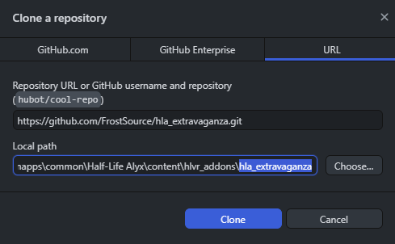
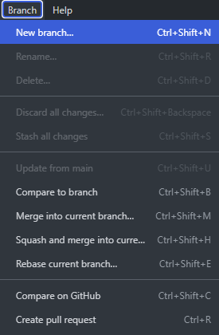
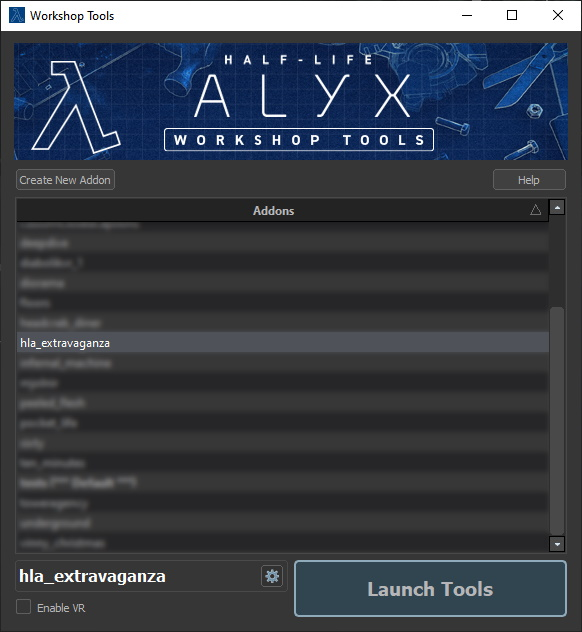

# Contributing assets

> This guide explains the process of submitting a contribution to us for users to download. Each submission should be on a separate branch and contain only the files necessary for that contribution. If you have multiple prefabs to submit you should do so individually.

> GitHub Desktop is used in this guide but you may use any method you prefer for interacting with Git.

---

[GitHub Desktop](https://desktop.github.com/) is a simple Git utility program useful for beginners. It will install the latest Git along with it.

Clone this repository (https://github.com/FrostSource/hla_extravaganza.git) to your own Half-Life: Alyx addons content directory, which is usually `C:\Program Files (x86)\SteamLibrary\steamapps\common\Half-Life Alyx\content\hlvr_addons\` using `Ctrl+Shift+O` or by going to `File>Clone repository...`

Create a branch from the master using `Ctrl+Shift+N` or by going to `Branch>New branch...`

This branch will be the one you use to work on your assets separately from the main branch. We use the following naming format for contributions but you are allowed to use any name as long as it is descriptive and distinct:

    asset_type-asset_title

Examples:

    prefab-keycard_reader
    guide-contributing

Open the Half-Life: Alyx workshop tools through Steam and launch the `hla_extravaganza` addon.

*If the addon is not present in the list you will need to `Create New Addon` with the same name as the addon folder for it to be recognized.*

Add/create your files within the relevant folders/subfolder.

Test/proof-read your contribution to make sure there are no bugs or missing text. If your contribution is a prefab or other non-markdown asset, make sure you also include a README.md file to explain how it works. You can grab a copy of a template README.md for your asset type from [the templates directory](./././templates/)

